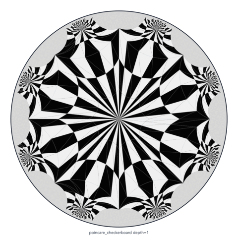

# Graph Morphing Problem on Hyperbolic Surface

You can generate your hyperbolic kaleidoscope: morphing a genus-2 triangulation in the Poincare disk with smooth sin(8θ) edge weights, turning discrete geometry into black-and-white motion art.

## Sin(8θ) Kaleidoscope Preview

These previews show the same 50-frame morph rendered with tile depths `0`, `1`,
and `2`. The animated GIFs render inline on GitHub; the MP4 files are linked
below for playback or download.

| Tile depth 0 | Tile depth 1 | Tile depth 2 |
| --- | --- | --- |
|  |  |  |
| [Open depth 0 MP4](output/checkerboard_morph/Z0_to_Z1_sin8_1_50_ring_alternating/sin8_ring_alternating_depth0.mp4) | [Open depth 1 MP4](output/checkerboard_morph/Z0_to_Z1_sin8_1_50_ring_alternating/sin8_ring_alternating_depth1.mp4) | [Open depth 2 MP4](output/checkerboard_morph/Z0_to_Z1_sin8_1_50_ring_alternating/sin8_ring_alternating_depth2.mp4) |

## How to use