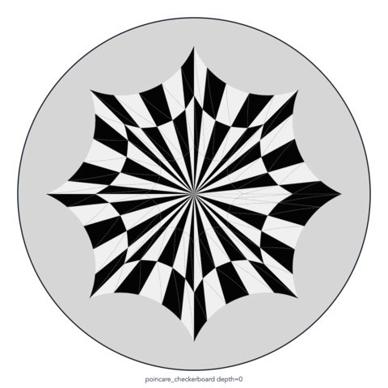
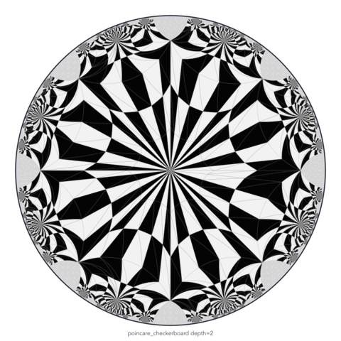

# Hyperbolic Shape Morphing in the Poincaré Disk

`hyper_morph` generates morph frames between two graph embeddings. It also
computes discrete harmonic maps and directed hyperbolic mean-value weights for
graphs embedded in the Poincaré disk.

## Example

The same 50-frame genus-2 morph is shown at three tiling depths.

| Depth 0 | Depth 1 | Depth 2 |
| --- | --- | --- |
|  |  |  |


## Installation
We use uv to manage the environment and dependencies. 

```
uv sync
```
will install the package into the current environment so that you can use `import hyper_morph` in your code.

## Method summary

1. Load compatible source and target embeddings.

   ```python
   import json

   with open("source.json", encoding="utf-8") as file:
       source = json.load(file)
   with open("target.json", encoding="utf-8") as file:
       target = json.load(file)
   ```

2. Compute a harmonic endpoint embedding when needed (mean value coordinates need convex embeddings).

   ```python
   from hyper_morph import HarmonicMapSolver
   
   source = HarmonicMapSolver(source).solve()
   target = HarmonicMapSolver(target).solve()
   ```

3. Compute and interpolate the directed hyperbolic mean-value weights.

   ```python
   from hyper_morph import DirectedEdgeWeightCalculator
   from hyper_morph.morph import (
       average_edge_weights,
       interpolate_directed_weights,
   )
   # compute the directed edge weights for the source and target embeddings
   source_weights = DirectedEdgeWeightCalculator(
       source, normalization="normalized"
   ).compute()
   target_weights = DirectedEdgeWeightCalculator(
       target, normalization="normalized"
   ).compute()
   # comptue the interpolated directed edge weights at time t
   t = 0.5
   frame_weights = interpolate_directed_weights(source_weights, target_weights, t)
   ```

4. Solve each morph frame with the interpolated weights.

   ```python
   frame_input = {
       **source,
       "edge_weights": average_edge_weights(frame_weights),
       "directed_edge_weights": [list(weights) for weights in frame_weights],
       "edge_force_model": "hyperbolic_mean_value",
       "line_search_objective": "none",
   }
   frame = HarmonicMapSolver(frame_input).solve()
   ```

See the [quick start](quick_start.md) for the input schema, complete commands,
arguments, and Python examples.
